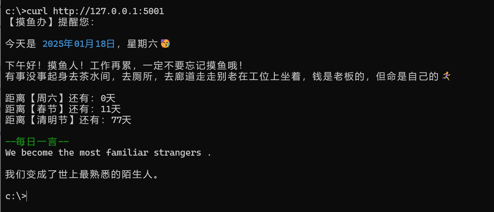

## 命令行中的摸鱼日历

> 我是一名前端开发，正在学习python。项目是受 [chubin/wttr](https://github.com/chubin/wttr.in) 的启发编写的，写了这个练习项目，欢迎大家提交批评建议。

### 安装
``` bash
pip install -r requirements.txt
```

### 运行
``` bash
python main.py
```
### 使用
``` bash
# 命令行
curl http://127.0.0.1:5001

#浏览器直接打开
http://127.0.0.1:5001
```
### 截图



### 感谢
* [chubin/wttr](https://github.com/chubin/wttr.in)
* [获取公共节假日](https://date.nager.at)
* [API接口](https://oiapi.net)


